<p align="center">
  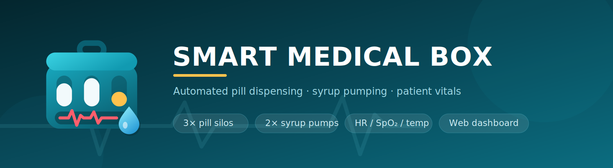
</p>

<p align="center">
  
  
  
  
  
</p>

A desk-sized medicine cabinet that dispenses the right pills at the right time, pumps a
measured dose of syrup after them, and reads the patient's vitals while it does it.

Three motorised silos drop one tablet each into a shared tray. A piezo disc under the tray
listens for the drop, so the box counts pills it has actually delivered rather than pills it
*thinks* it delivered. Two peristaltic pumps then run for a configurable duration. Everything
is driven by a schedule you set from a browser — morning, day and night can each have their
own silo order, pump order and dose length.

A second ESP32 handles the patient side: heart rate, SpO₂, body temperature and the water
tank level, shown live on a 3.5" TFT and pushed over Wi-Fi to the main controller so the web
dashboard sees them too.

---

## The build

| Assembled | Inside | On the bench |
|:--:|:--:|:--:|
| 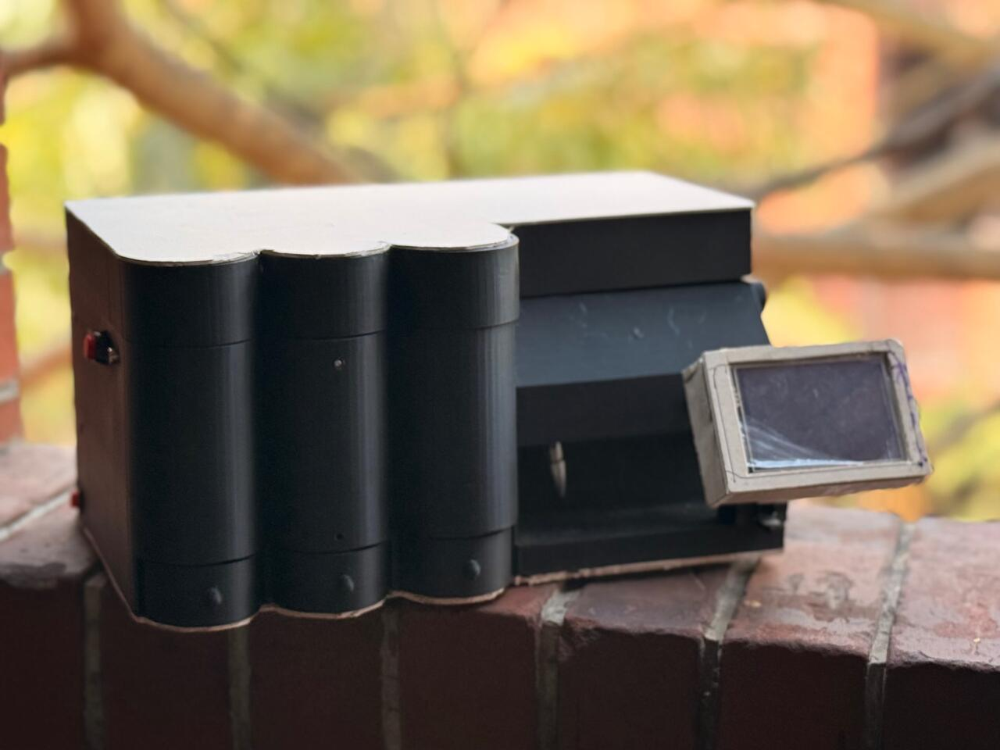 | 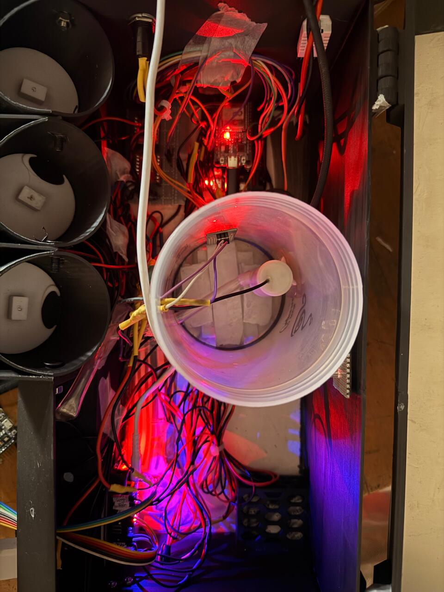 | 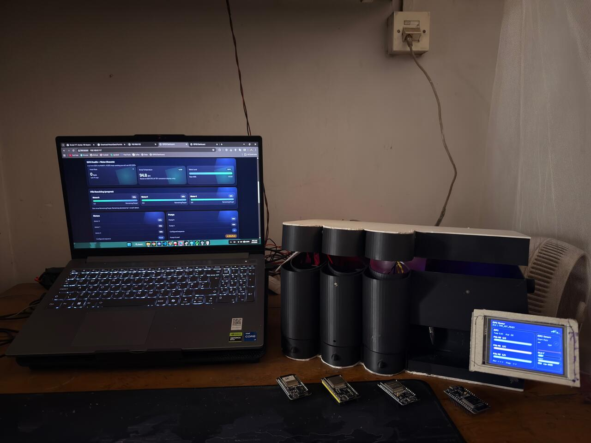 |
| Three pill silos, hinged lid, TFT on a swing-out arm | Silos, water reservoir, drivers and the UV strip | Dashboard in the browser, TFT mirroring it |

### The dashboard

Served straight from the controller's flash — one HTML page, no app, no cloud, no account.
Open the box's address on any device on the same network.

<p align="center">
  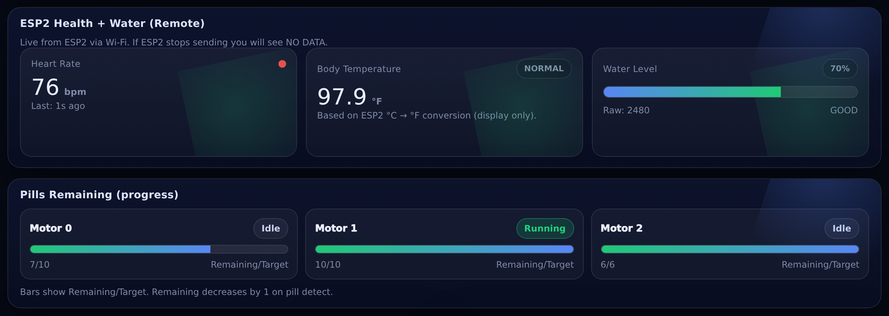
</p>

---

## What it does

**Dispensing**

- 3 independent pill silos, each on its own gear motor and rotating disc
- One pill per rotation; the disc pocket only ever holds a single tablet
- Piezo-disc drop detection — the motor stops the moment a pill is heard, not after a fixed time
- Per-silo pill counters that survive a power cut (stored in NVS)
- The sequence skips any silo whose counter has reached zero

**Liquid**

- 2 pumps, each with short / medium / long dose presets (1.0–5.0 s)
- Pumps run only after every scheduled silo has delivered
- Analog water-level probe with a smoothed percentage readout

**Patient monitoring**

- MAX30102 for heart rate and SpO₂, with finger-presence detection so it doesn't report noise
- I²C body-temperature sensor, clamped to a plausible 34–41 °C window
- DHT22 for cabinet temperature and humidity
- Live 3.5" TFT panel with a pulse waveform, thermometer bar and tank gauge

**Control**

- Built-in web dashboard on the controller — no app, no cloud, no account
- Three schedule windows (morning / day / night), each with its own silo and pump programme
- NTP clock so the windows follow real local time
- Physical start button, plus a latching emergency switch that cuts every output and sirens
- Four status LEDs: sequence started, sequence done, pump started, pump done

---

## How it works

The controller runs a four-state machine. One press of the start button (or `GET /startSequence`)
walks it all the way through:

```
        ┌──────┐   button / web    ┌────────────┐
        │ IDLE │ ────────────────► │ RUN_MOTOR  │ ◄──────────────┐
        └──────┘                   └─────┬──────┘                │
            ▲                            │ piezo > 400           │ next silo
            │                            ▼                       │ in the sequence
            │                    ┌─────────────────┐             │
            │                    │ WAIT_AFTER_PILL │ ────────────┘
            │                    └────────┬────────┘
            │                             │ all silos done
            │                             ▼
            │   last pump finished  ┌──────────┐
            └────────────────────── │ RUN_PUMP │
                                    └──────────┘
```

At the moment the button is pressed the firmware looks at the clock, picks whichever schedule
window is active, and copies that window's silo order, pump order and dose lengths into the
runtime. If no window is active it falls back to the saved defaults. That is why the same
button gives you two tablets in the morning and one at night without you touching anything.

The emergency switch is checked on every loop iteration, ahead of the state machine — it drops
the state back to `IDLE`, kills all motors and pumps, and toggles the buzzer every 200 ms for
as long as it is held.

---

## System architecture

The two boards are **not** wired to each other. They talk over Wi-Fi on the local network:

```
   ESP32 #2  (sensors + TFT)                    ESP32 #1  (controller)
   ─────────────────────────                    ─────────────────────
   MAX30102   ──┐                               3 × gear motor + driver
   Temp 0x7F  ──┼─ I²C                          2 × pump relay
   Water probe ─┘                               Piezo disc, DHT22
        │                                       Button, emergency, buzzer, LEDs
        │  GET /ingest?bpm=&body=&water=   ───►         │
        │           every 1.5 s                         │
        │                                               ▼
        │  GET /status  ◄───────────────────────  WebServer :80
        │           every 1 s, JSON                  + NVS + NTP
        ▼                                               │
   3.5" TFT 480×320                                     ▼
                                                  Browser dashboard
```

ESP32 #2 pushes its readings to `/ingest` and polls `/status` for everything the controller
knows, so the TFT and the browser always show the same numbers. If the controller drops off the
network, the TFT falls back to showing `ESP1 OFFLINE` and keeps displaying its own local sensors.

---

## Circuit

<p align="center">
  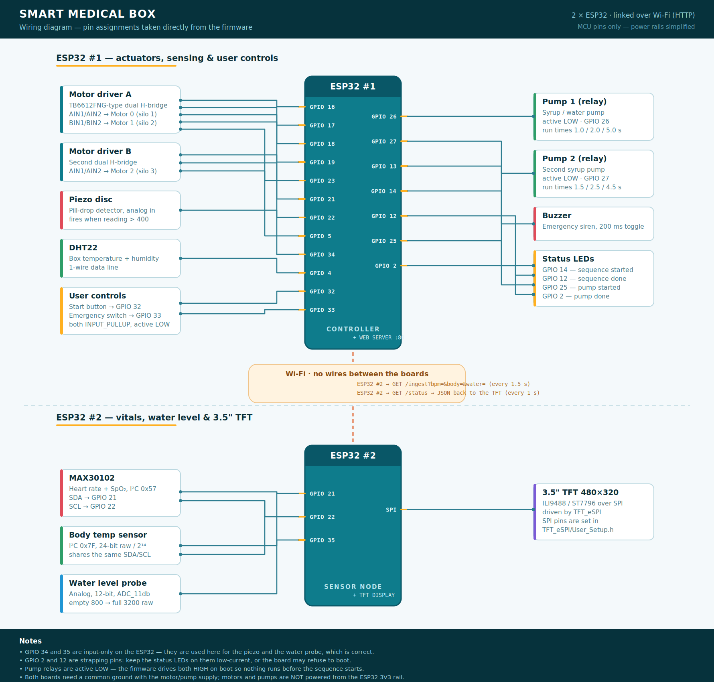
</p>

> Vector version: [`assets/circuit-diagram.svg`](assets/circuit-diagram.svg)

### ESP32 #1 — controller

| GPIO | Direction | Connected to |
|:----:|:---------:|--------------|
| 16 / 17 | out | Motor driver A — AIN1 / AIN2 → **Motor 0** (silo 1) |
| 18 / 19 | out | Motor driver A — BIN1 / BIN2 → **Motor 1** (silo 2) |
| 21 / 22 | out | Motor driver B — AIN1 / AIN2 → **Motor 2** (silo 3) |
| 23 | out | Driver A `STBY` (held HIGH) |
| 5  | out | Driver B `STBY` (held HIGH) |
| 34 | analog in | Piezo disc — pill-drop detector, fires above **400** |
| 26 | out | Pump 1 relay — **active LOW** |
| 27 | out | Pump 2 relay — **active LOW** |
| 32 | in, pull-up | Start button (active LOW) |
| 33 | in, pull-up | Emergency switch (active LOW) |
| 13 | out | Buzzer |
| 14 | out | LED — sequence started |
| 12 | out | LED — sequence done |
| 25 | out | LED — pump started |
| 2  | out | LED — pump done |
| 4  | 1-wire | DHT22 data |

### ESP32 #2 — sensor node + display

| GPIO | Direction | Connected to |
|:----:|:---------:|--------------|
| 21 | I²C SDA | MAX30102 (`0x57`) and temperature sensor (`0x7F`) |
| 22 | I²C SCL | same bus |
| 35 | analog in | Water-level probe, 12-bit, `ADC_11db` |
| — | SPI | 3.5" TFT — pins live in `TFT_eSPI/User_Setup.h`, not in the sketch |

Full notes, calibration constants and gotchas: [`docs/pinout.md`](docs/pinout.md)

---

## Bill of materials

| Qty | Part | Notes |
|:---:|------|-------|
| 2 | ESP32 dev board (30/38-pin) | one controller, one sensor node |
| 1 | 3.5" TFT, 480×320 | ILI9488 or ST7796, SPI |
| 3 | DC gear motor | low RPM, one per silo |
| 2 | Dual H-bridge driver with `STBY` | TB6612FNG-type; 2 boards cover 3 motors |
| 2 | Pump + relay module | active-LOW relay board |
| 1 | Piezo disc | drop sensor under the tray |
| 1 | MAX30102 | heart rate and SpO₂ |
| 1 | I²C temperature sensor `0x7F` | body temperature |
| 1 | DHT22 | cabinet temperature and humidity |
| 1 | Water-level probe | analog |
| 1 | Buzzer | emergency siren |
| 4 | LED + resistor | status indicators |
| 1 | Push button | start |
| 1 | Latching switch | emergency stop |
| — | 5 V / 12 V supply | for motors and pumps, **common ground with both ESP32s** |
| — | 3D-printed enclosure | see below |

---

## 3D-printed parts

Seven STL files in [`hardware/3d/`](hardware/3d). Everything prints flat-ish; the chassis is the
only part that needs a large bed.

| Part | File | Bounding box (mm) | Qty |
|------|------|:-----------------:|:---:|
| Main chassis | `main-chassis.stl` | 231 × 354 × 143 | 1 |
| Top lid / cover | `lid-top-cover.stl` | 231 × 247 × 46 | 1 |
| Pill silo tube | `pill-silo-tube.stl` | 59 × 59 × 61 | 3 |
| Silo base hopper | `silo-base-hopper.stl` | 59 × 73 × 30 | 3 |
| Dispenser disc | `dispenser-disc.stl` | 54 × 53 × 9 | 3 |
| Motor / gearbox mount | `motor-gearbox-mount.stl` | 50 × 30 × 36 | 3 |
| Catch tray | `catch-tray.stl` | 50 × 51 × 21 | 1 |

<table>
  <tr>
    <td align="center">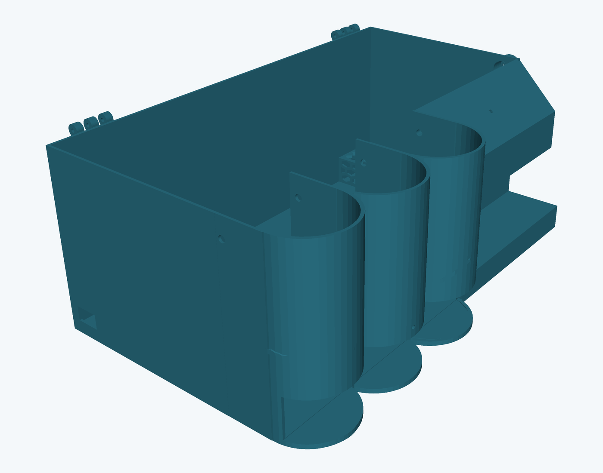<br><sub>Main chassis</sub></td>
    <td align="center">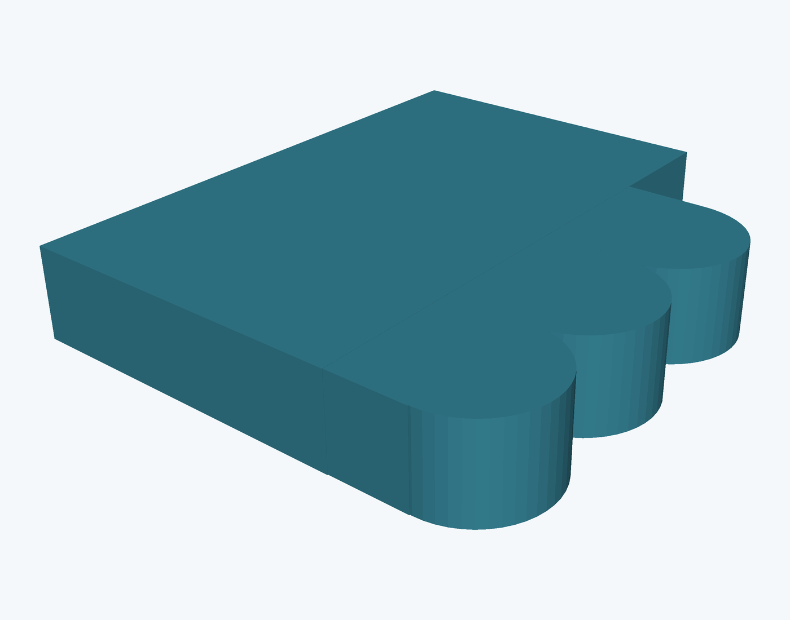<br><sub>Top lid</sub></td>
    <td align="center">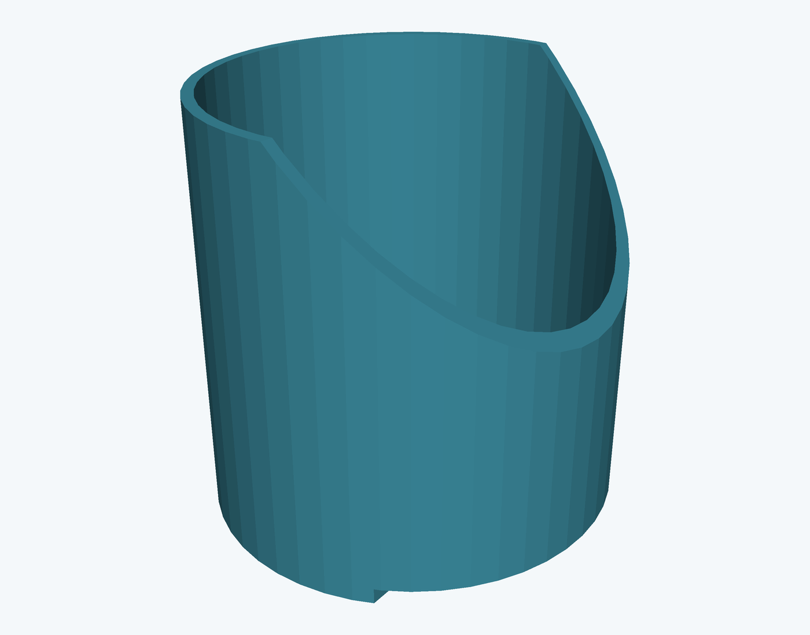<br><sub>Silo tube</sub></td>
  </tr>
  <tr>
    <td align="center"><br><sub>Silo base hopper</sub></td>
    <td align="center">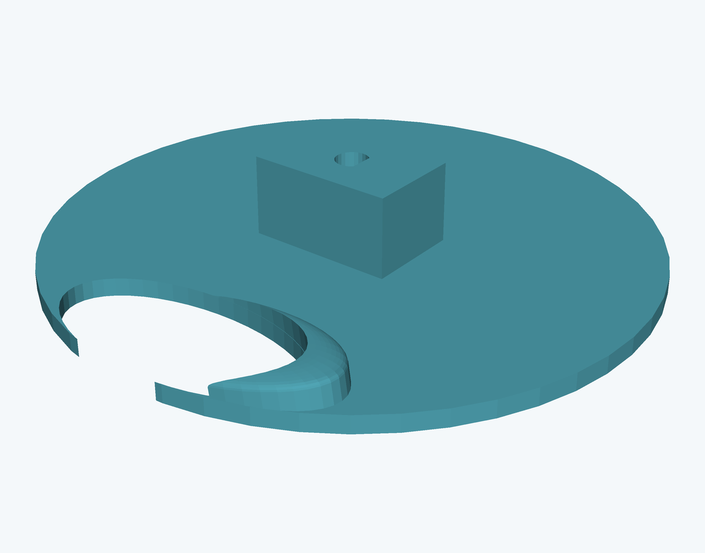<br><sub>Dispenser disc</sub></td>
    <td align="center">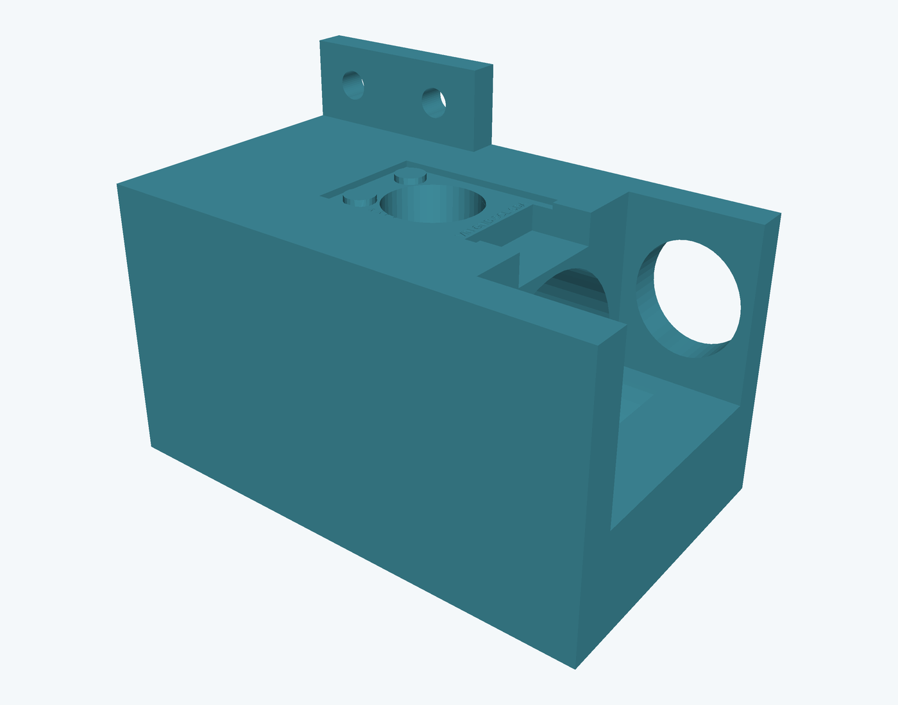<br><sub>Motor mount</sub></td>
  </tr>
</table>

CAD views of every part, including the exploded assembly, are in [`images/cad/`](images/cad).

<p align="center">
  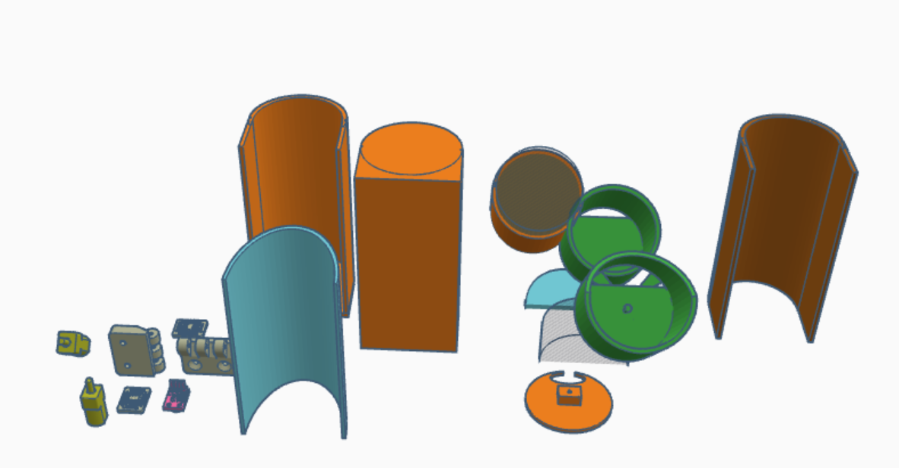<br>
  <sub>Exploded view — all printed parts</sub>
</p>

---

## Getting started

### 1. Libraries

Install through the Arduino Library Manager:

| Sketch | Libraries |
|--------|-----------|
| `esp1_controller` | `DHT sensor library` (Adafruit) + `Adafruit Unified Sensor` |
| `esp2_display` | `ArduinoJson`, `SparkFun MAX3010x`, `TFT_eSPI` |

Plus the **esp32** board package by Espressif (Boards Manager).

### 2. Configure Wi-Fi

Both sketches ship with placeholders. Edit them before flashing:

```cpp
const char* ssid     = "YOUR_WIFI_SSID";
const char* password = "YOUR_WIFI_PASSWORD";
```

### 3. Flash the controller first

Open [`firmware/esp1_controller`](firmware/esp1_controller), upload, then open the serial
monitor at **115200**. It prints its address:

```
WiFi Connected. IP: 192.168.0.101
```

### 4. Point the sensor node at it

In [`firmware/esp2_display`](firmware/esp2_display), set that address:

```cpp
const char* ESP1_IP = "192.168.0.101";
```

Configure `TFT_eSPI` for your panel by editing `User_Setup.h` in the library folder — driver,
SPI pins and `TFT_WIDTH 320` / `TFT_HEIGHT 480`. Then upload.

### 5. Open the dashboard

Browse to the controller's address. Set the pill counts, pick the silo and pump order, tune the
schedule windows, and press **Start** — or just press the physical button on the box.

---

## Web dashboard & HTTP API

Everything the dashboard does is a plain `GET`, so you can drive the box from `curl`, a
smart-home hub, or anything else on the network.

**Schedules** — three windows, each with its own silo order, pump order and dose presets:

<p align="center">
  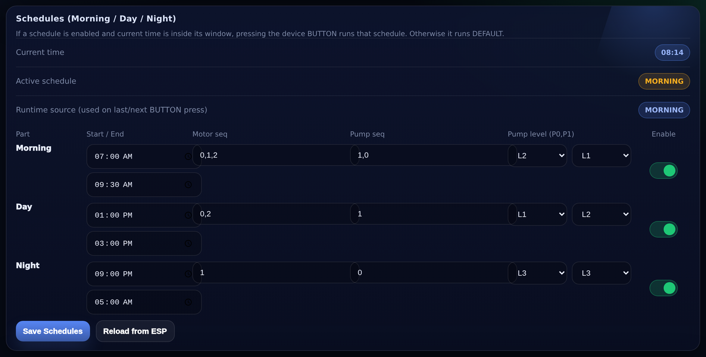
</p>

**Live state** — what is running right now, the configured sequences, cabinet climate and the
pill targets:

<p align="center">
  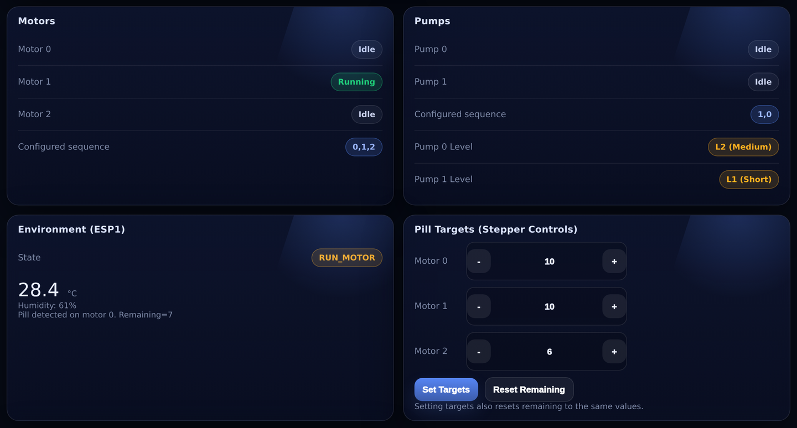
</p>

**Sequence builder** — tap to append, drag to reorder, or type the CSV directly:

<p align="center">
  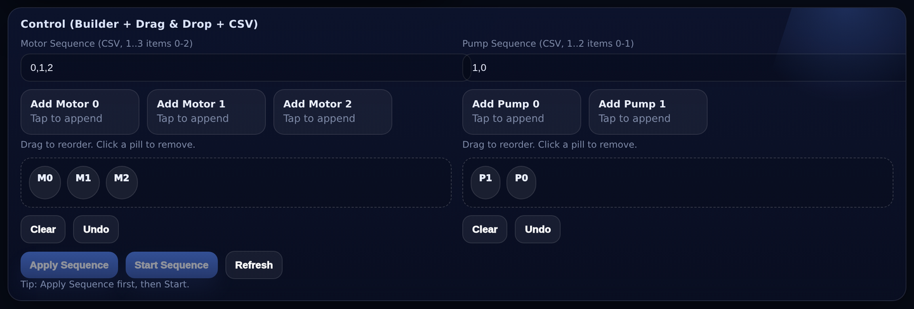
</p>

> The whole page in one shot: [`images/dashboard/dashboard-full.png`](images/dashboard/dashboard-full.png)

| Endpoint | Query parameters | Does |
|----------|------------------|------|
| `/` | — | The dashboard page |
| `/status` | — | Full JSON state: motors, pumps, pills, DHT, sequence state, clock, remote sensors |
| `/startSequence` | — | Starts a run. `409` if one is already going |
| `/setSequence` | `motors=0,1,2` `pumps=1,0` | Sets the default silo and pump order. Values `0–2` / `0–1`, no duplicates |
| `/setPills` | `m0=` `m1=` `m2=` | Sets target **and** remaining counts per silo |
| `/resetPills` | — | Refills remaining back up to target |
| `/setPumpLevels` | `p0=` `p1=` | Dose preset per pump: `0` short, `1` medium, `2` long |
| `/getParts` | — | Returns all three schedule windows as JSON |
| `/setParts` | see below | Writes all three windows at once |
| `/ingest` | `bpm=` `body=` `water=` `ir=` | Used by ESP32 #2 to push its readings |

`/setParts` takes seven parameters per window, prefixed `m_` (morning), `d_` (day), `n_` (night):

```
m_en=1  m_s=360  m_e=600  m_m=0,1,2  m_p=1,0  m_l0=1  m_l1=0
        └ minutes past midnight ┘    └ silos ┘ └pumps┘ └ dose presets ┘
```

Anything that changes configuration is refused with `409` while a sequence is running, and every
accepted change is written to NVS immediately.

Worked examples: [`docs/api.md`](docs/api.md)

---

## Schedules

Three windows, each independently enabled, each with its own programme. Defaults:

| Window | Time | Silos | Pumps | Dose presets |
|--------|------|-------|-------|--------------|
| Morning | 06:00 – 10:00 | 0, 1, 2 | 1, 0 | medium / short |
| Day | 10:00 – 18:00 | 0, 2 | 1 | short / medium |
| Night | 18:00 – 06:00 | 1 | 0 | long / long |

All three ship **disabled** so the box uses the saved defaults until you turn them on. Windows
may wrap past midnight — the night window above is handled correctly.

Pump run times, in milliseconds:

| | short | medium | long |
|---|:---:|:---:|:---:|
| Pump 0 | 1000 | 2000 | 5000 |
| Pump 1 | 1500 | 2500 | 4500 |

---

## Calibration

Three constants are worth tuning for your build — all of them are at the top of the sketches.

**Piezo threshold** (`esp1_controller`, `PIEZO_THRESHOLD 400`)
Print the raw `analogRead(PIEZO)` while dropping a tablet. Set the threshold roughly halfway
between the resting value and the peak. Too low and motor vibration registers as a pill; too
high and small tablets are missed and the motor keeps turning.

**Water probe** (`esp2_display`, `WATER_EMPTY_RAW 800` / `WATER_FULL_RAW 3200`)
Read the raw ADC with the tank empty and again full, and put those two numbers in. The reading
is smoothed 70/30 against the previous sample, so it settles over a few seconds instead of
jumping.

**Body temperature offset** (`esp2_display`, `BODY_TEMP_OFFSET_C 1.5f`)
A skin-contact sensor reads below core temperature. Compare against a clinical thermometer and
adjust. The result is clamped to 34–41 °C.

---

## Repository layout

```
Smart-Medical-Box/
├── firmware/
│   ├── esp1_controller/        main controller — motors, pumps, web server, schedules
│   ├── esp2_display/           sensor node — MAX30102, temperature, water, TFT
│   └── archive/                earlier iterations, kept for reference
│       ├── esp1_controller_early/
│       └── vitals_oled_test/   MAX30102 + SH1106 OLED bring-up sketch
├── hardware/
│   └── 3d/                     7 STL files for the printed enclosure
├── docs/
│   ├── pinout.md               complete pin map, constants and electrical notes
│   └── api.md                  HTTP API with curl examples
├── images/
│   ├── build/                  photos of the finished box
│   ├── dashboard/              screenshots of the web dashboard
│   ├── cad/                    CAD views of every part
│   └── render/                 renders straight from the STLs
├── assets/                     logo, banner, wiring diagram (PNG + SVG)
└── README.md
```

---

## Roadmap

From the original design notes — what is in, and what is still to come.

- [x] Water / syrup level indicator
- [x] Tablet drop detection
- [x] Emergency stop with siren
- [x] Patient vitals — HR, SpO₂, body temperature
- [x] Scheduled dosing windows
- [ ] RTC module, so the clock survives a Wi-Fi outage instead of relying on NTP
- [ ] SD card logging of every dose delivered
- [ ] Silica gel slot with a humidity-triggered reminder
- [ ] UV sterilisation cycle for the tray
- [ ] Syrup mixing before the pump runs
- [ ] GSR skin sensor
- [ ] Magnetic door sensor to log when the box is opened

---

## Safety

This is a student hardware project, not a medical device. It has no redundancy, no fail-safe
dosing lockout and no regulatory approval. Do not use it to manage medication anybody actually
depends on.

---

## Author

**Md. Mahin Rahman**
GitHub: [@thisisdibbo](https://github.com/thisisdibbo)
Email: mr.d2003feb@gmail.com

## License

MIT — see [LICENSE](LICENSE).
